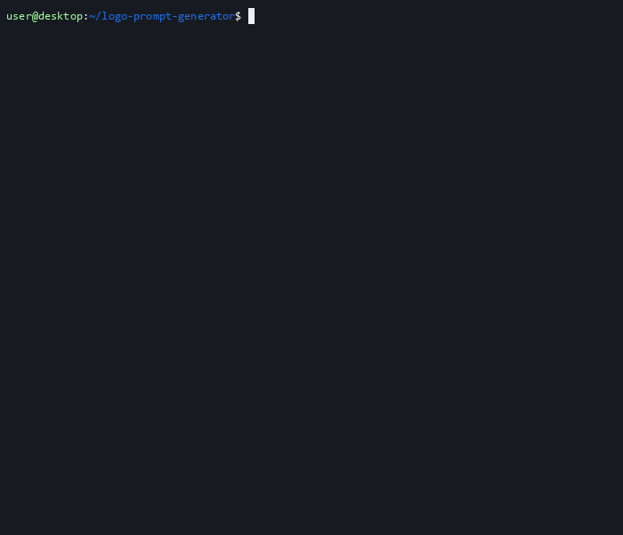

<div align="center">

# Logo Prompt Generator

**Stop writing vague prompts. Generate production-grade logo briefs for DALL-E 3, Midjourney and Stable Diffusion in 60 seconds.**

[](https://www.python.org/)
[](LICENSE)
[](https://github.com/amys94fr/logo-prompt-generator)
[](https://github.com/amys94fr/logo-prompt-generator)
[](https://github.com/amys94fr/logo-prompt-generator/pulls)

[Quick Start](#quick-start) · [Demo](#demo) · [Why](#why-this-exists) · [Features](#features) · [Examples](#examples) · [Roadmap](#roadmap)



</div>

---

## The Problem

You sit down to generate a logo with DALL-E. You type:

> *"Create a logo for my SaaS company. Something modern and clean."*

DALL-E returns four mediocre icons that look like every stock template on Dribbble. You try again. And again. Twenty credits later, you give up and pay an agency $2,000.

**The problem isn't the model. It's the prompt.**

Great logo prompts have structure: brand identity, visual concept, color hex codes, typography direction, composition rules, and an explicit list of things to avoid. Writing one from scratch every time is tedious. Forgetting half the elements is what gives you generic results.

This tool fixes that.

## What You Get

A single Python script that asks you 8 well-designed questions, then assembles a structured, model-optimized prompt you can paste straight into ChatGPT, Midjourney, or any SDXL frontend. No setup. No dependencies. No accounts.

## Demo

The GIF at the top shows a complete 30-second session. The raw asciinema recording is also available at [`demo/logo-prompt-generator.cast`](demo/logo-prompt-generator.cast) and can be replayed with `asciinema play`.

To regenerate everything after changing the script:

```bash
python scripts/generate_demo_cast.py
# then re-render the GIF with agg
# (see scripts/generate_demo_cast.py header for details)
```

### Session walkthrough

```
$ python generateur_prompt_logo.py

════════════════════════════════════════════════════════════════
  Logo Prompt Generator: DALL-E 3 / Midjourney / SDXL
════════════════════════════════════════════════════════════════

┌─ Step 1/8
│  Brand identity
└──────────────────────────────

Q What is the name of your brand?
 > Lumen

Q What sector does your brand operate in?
    1. Technology / SaaS
    2. Restaurant / Café / Food
    3. Fashion / Luxury
   ...
 > 1

... (6 more questions, 60 seconds total) ...

════════════════════════════════════════════════════════════════
  Generated prompt (copied to clipboard)
════════════════════════════════════════════════════════════════

Create a combination mark logo for "Lumen", a technology / saas company.

CONCEPT & VALUES
The logo should evoke innovation and modernity, trustworthiness and stability.
A stylized beam of light passing through a lens, suggesting clarity and precision.

VISUAL ELEMENTS
A minimalist abstract shape combining a circular lens with a thin diagonal light ray,
forming the letter "L" through negative space.

STYLE
minimalist, geometric, flat design, professional, scalable vector design.

COLOR PALETTE
deep navy blue (#1A2B4A), bright sky blue (#3B82F6), white (#FFFFFF).
...
```

## Why This Exists

| Approach | Time | Output quality | Hit rate |
|----------|------|----------------|----------|
| Typing a one-liner into DALL-E | 5 sec | Stock-icon mediocrity | ~10% |
| Writing a structured brief by hand | 15-20 min | Excellent | ~70% |
| **Logo Prompt Generator** | **60 sec** | **Excellent** | **~70%** |

The tool gives you 90% of the value of a hand-written brief, in 5% of the time. You stay in your terminal, you keep your iteration loop tight, and the prompts produce reproducible results across multiple providers.

## Features

- **8-step guided interview**: brand, sector, logo type, values, visual concept, main element, style, color & typography
- **15 sectors** covered, from SaaS to Web3 to artisan food
- **8 logo type classifications** (pictorial, wordmark, lettermark, combination, emblem, mascot, abstract, monogram), each with a recognizable reference brand
- **10 hand-tuned color palettes** with hex codes, ready to paste
- **15 graphic style modifiers** (minimalist, Bauhaus, isometric, negative space, Japanese zen, and more)
- **Quick mode** (`--quick`) for power users: 4 questions, presets pre-selected
- **Cross-platform clipboard copy**: Windows `clip`, macOS `pbcopy`, Linux `xclip` / `xsel` / `wl-copy`
- **Three export formats**: `.txt` (ready to paste), `.json` (machine-readable brief), `.md` (designer-ready briefing doc)
- **ANSI colored output** with automatic Windows console support and UTF-8 stdio
- **Zero external dependencies**: pure Python 3.10+ standard library

## Quick Start

```bash
git clone https://github.com/amys94fr/logo-prompt-generator.git
cd logo-prompt-generator
python generateur_prompt_logo.py
```

That's it. No `pip install`, no virtualenv, no API keys. Python 3.10+ is the only requirement.

## Usage

### Full interactive mode

```bash
python generateur_prompt_logo.py
```

Eight guided questions. Around 60 seconds. Produces the most detailed prompt.

### Quick mode

```bash
python generateur_prompt_logo.py --quick
```

Four questions only: brand name, sector, logo type, palette. Everything else uses sensible defaults. Ideal for rapid iteration once you know what you want.

### CLI options

| Flag | Description |
|------|-------------|
| `--quick` | Quick mode with presets |
| `--no-color` | Disable ANSI colors in the terminal |
| `--output-dir DIR` | Output directory for generated files (default: `./output`) |

## Examples

### Before: a typical AI-generated logo prompt

```
A logo for a coffee shop called "Roastery", modern style
```

DALL-E result: a generic coffee bean icon in brown, identical to half the cafés in your city.

### After: the same brief, processed by this tool

```
Create an emblem logo for "Roastery", a restaurant / café / food business.

CONCEPT & VALUES
The logo should evoke warmth and friendliness, premium craftsmanship, nature and
authenticity. An emblem that pays homage to traditional roasting craft while feeling
contemporary, with subtle nods to the bean-to-cup journey.

VISUAL ELEMENTS
A circular badge framing a stylized side-view silhouette of a single coffee cherry on
a branch, with two leaves arranged symmetrically. The cherry is rendered as a clean
geometric drop shape rather than literal photography.

STYLE
vintage / retro, line art with thin strokes, monochromatic, professional, scalable
vector design.

COLOR PALETTE
terracotta (#C97D60), warm beige (#E6CCB2), olive (#6A7E40).

TYPOGRAPHY
vintage typography with subtle ornaments. If text is included, ensure perfect kerning
and crisp legibility at any size.

COMPOSITION
Centered and balanced, generous negative space, isolated on a clean pure white
(#FFFFFF) background, high contrast for maximum readability from favicon size to
billboard scale.

TECHNICAL REQUIREMENTS
- Flat 2D vector style with crisp edges
- Single icon, no mockups, no business card layouts
- Scalable and reproducible in a single color
- High resolution suitable as a brand identity asset

AVOID
Photo-realistic rendering, drop shadows, complex gradients, watermarks, signature
artifacts, text rendering errors, generic stock-icon aesthetics, copyrighted symbols
or trademarks of existing brands, 3D rendering, glossy plastic look, busy backgrounds.
```

Same coffee shop. Completely different category of output.

## Recommended Workflow

1. Run the generator. The prompt is auto-copied to your clipboard.
2. Paste into ChatGPT (with DALL-E 3), Midjourney, or any SDXL frontend.
3. Ask for iterations directly in the chat:
   - `Generate 3 variations with different compositions`
   - `Make it more minimalist, remove the ornaments`
   - `Switch to a monochromatic black and white version`
4. For final text rendering, retouch in Figma or Canva. Image models still struggle with precise letterforms.

## Project Structure

```
logo-prompt-generator/
├── generateur_prompt_logo.py       # The script (single file, ~450 lines)
├── scripts/
│   └── generate_demo_cast.py       # Regenerates the asciinema demo
├── demo/
│   └── logo-prompt-generator.cast  # Asciinema v2 recording
├── README.md
├── LICENSE                         # MIT
├── .gitignore
└── output/                         # Generated briefs land here (gitignored)
```

## Roadmap

- [ ] Web version (Next.js + Vercel AI Gateway) with one-click image generation built in
- [ ] Saved-brief library: reload past briefs and iterate
- [ ] Moodboard support: pass reference image URLs into the prompt
- [ ] Bilingual output: prompt in English and French side by side
- [ ] Provider-specific tuning: separate templates optimized for Midjourney v6, SDXL, and DALL-E 3
- [ ] Brand style guide export: generate a one-page PDF brief alongside the prompt

## Contributing

PRs welcome. The most valuable contributions right now:

- New sectors, styles, or palettes (edit the constants at the top of `generateur_prompt_logo.py`)
- Bug reports with reproducible terminal output
- Improvements to the prompt template itself, with before / after comparisons of generated images

Open an issue first if you want to discuss a non-trivial change.

## License

[MIT](LICENSE). Use it, fork it, ship it.

---

<div align="center">

**If this saved you 20 minutes, consider starring the repo.**

</div>
